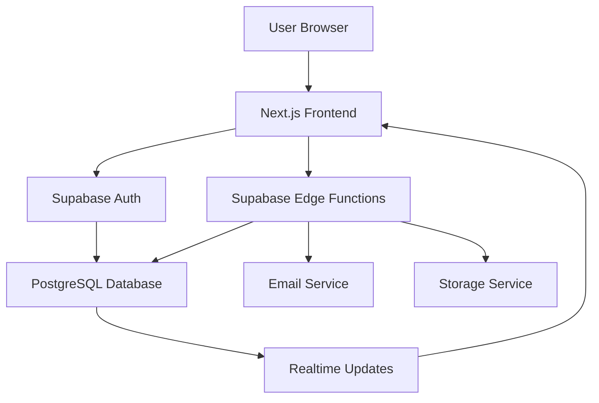

# Structured Product Requirements Document (PRD) - Leave Management System

## Document Information
- **Document Version**: 1.0
- **Last Updated**: 2025-10-12
- **Author**: AI Development Team
- **Status**: Draft
- **Reviewers**: [Add stakeholders]

---

## 1. Executive Summary

### 1.1 Product Overview
A comprehensive Leave Management System built with Next.js 15, TypeScript, and Supabase backend. The system provides secure, scalable leave request management with role-based access control, approval workflows, document management, and reporting capabilities.

### 1.2 Business Value
- Streamlined leave request and approval processes
- Reduced administrative overhead through automation
- Improved compliance with labor regulations
- Enhanced employee experience with self-service capabilities
- Data-driven decision making through comprehensive reporting

### 1.3 Success Metrics
- 95% reduction in manual leave processing time
- 99% system uptime target
- WCAG 2.1 AA accessibility compliance
- < 2.5s page load times (LCP)
- 4.5:1 color contrast ratio for accessibility

---

## 2. User Personas & Roles

### 2.1 Primary Personas

#### Employee
- **Goals**: Submit leave requests, view balances, track status
- **Pain Points**: Manual paperwork, lack of transparency, difficulty tracking remaining leave
- **Technical Proficiency**: Basic to moderate

#### Manager
- **Goals**: View team calendar, approve/reject requests, manage team schedules
- **Pain Points**: Inefficient approval processes, difficulty coordinating team absences
- **Technical Proficiency**: Moderate to advanced

#### HR/Admin
- **Goals**: Manage users, define leave policies, generate reports, ensure compliance
- **Pain Points**: Manual reporting, user management overhead, compliance tracking
- **Technical Proficiency**: Advanced

### 2.2 Role-Based Access Control Matrix

| Feature | Employee | Manager | HR | Admin |
|---------|----------|---------|----|-------|
| Submit Leave Request | ✅ | ❌ | ❌ | ❌ |
| View Personal Leave History | ✅ | ❌ | ❌ | ❌ |
| View Team Calendar | ❌ | ✅ | ✅ | ✅ |
| Approve/Reject Requests | ❌ | ❌ | ✅ | ✅ |
| Manage Users | ❌ | ❌ | ✅ | ✅ |
| Define Leave Types | ❌ | ❌ | ✅ | ✅ |
| Generate Reports | ❌ | ❌ | ✅ | ✅ |
| Document Management | ✅ | ❌ | ✅ | ✅ |

---

## 3. User Stories & Acceptance Criteria

### 3.1 Authentication & User Management

#### Story 1: Employee Registration
**As an** employee  
**I want to** create an account and register in the system  
**So that** I can access leave management features

**Acceptance Criteria:**
- [ ] User can register with email and password
- [ ] Email validation is performed during registration
- [ ] Password strength requirements are enforced (minimum 8 characters, mixed case, numbers)
- [ ] User receives confirmation email
- [ ] Profile setup wizard guides new users through initial configuration
- [ ] Social login integration (Google, Microsoft) is available

#### Story 2: User Authentication
**As a** user  
**I want to** securely login to the system  
**So that** I can access my leave management dashboard

**Acceptance Criteria:**
- [ ] Login form with email and password fields
- [ ] "Remember me" functionality
- [ ] Password reset flow via email
- [ ] Session management with automatic refresh
- [ ] Multi-factor authentication option
- [ ] Secure password storage using bcrypt

#### Story 3: Profile Management
**As an** employee  
**I want to** update my profile information  
**So that** my personal details are current

**Acceptance Criteria:**
- [ ] Edit personal information (name, contact details)
- [ ] Upload and manage profile photo
- [ ] Update emergency contact information
- [ ] View and edit notification preferences
- [ ] Profile validation ensures data completeness

### 3.2 Leave Request Management

#### Story 4: Create Leave Request
**As an** employee  
**I want to** submit a leave request  
**So that** my absence can be approved and planned for

**Acceptance Criteria:**
- [ ] Calendar interface for selecting leave dates
- [ ] Leave type selection (annual, sick, personal, etc.)
- [ ] Business day calculation excludes weekends and holidays
- [ ] Real-time balance validation before submission
- [ ] Reason text area with character limit
- [ ] Document upload capability for supporting documents
- [ ] Request submission confirmation with ticket number
- [ ] Email notification to manager and HR

#### Story 5: View Leave History
**As an** employee  
**I want to** view my past and current leave requests  
**So that** I can track my leave usage and status

**Acceptance Criteria:**
- [ ] Chronological list of all leave requests
- [ ] Status indicators (pending, approved, rejected, cancelled)
- [ ] Filter by status and date range
- [ ] Detailed view of each request with approval comments
- [ ] Balance summary showing used vs. remaining leave
- [ ] Export functionality for personal records

#### Story 6: Leave Balance Management
**As an** employee  
**I want to** view my available leave balances  
**So that** I can plan my time off effectively

**Acceptance Criteria:**
- [ ] Dashboard widget showing current balances by leave type
- [ ] Visual representation of used vs. available leave
- [ ] Historical balance tracking
- [ ] Automatic accrual calculations based on company policy
- [ ] Carry-over policy implementation
- [ ] Balance alerts when approaching limits

### 3.3 Manager Functions

#### Story 7: Team Calendar View
**As a** manager  
**I want to** view my team's leave calendar  
**So that** I can coordinate team schedules and coverage

**Acceptance Criteria:**
- [ ] Monthly/weekly calendar view with team members' leave
- [ ] Color-coded by leave type and status
- [ ] Clickable days showing detailed leave information
- [ ] Filter by team member and leave type
- [ ] Export calendar to external applications
- [ ] Overlap detection for team coverage planning

#### Story 8: Request Review & Approval
**As a** manager  
**I want to** review and act on team leave requests  
**So that** I can manage team availability efficiently

**Acceptance Criteria:**
- [ ] Dashboard showing pending requests with priority indicators
- [ ] Detailed request view with employee information
- [ ] Business impact assessment tools
- [ ] Approval/rejection workflow with comments
- [ ] Bulk approval capabilities for multiple requests
- [ ] Notification system for urgent requests
- [ ] Approval history tracking

### 3.4 Admin & HR Functions

#### Story 9: User Management
**As an** admin  
**I want to** manage system users  
**So that** I can maintain accurate employee records

**Acceptance Criteria:**
- [ ] User directory with search and filter capabilities
- [ ] Add/edit/delete user accounts
- [ ] Role assignment (employee, manager, HR, admin)
- [ ] Department and team management
- [ ] User import/export functionality
- [ ] Account activation/deactivation
- [ ] Audit trail for user management actions

#### Story 10: Leave Type Configuration
**As an** admin  
**I want to** configure leave types and policies  
**So that** the system aligns with company requirements

**Acceptance Criteria:**
- [ ] Create custom leave types with descriptions
- [ ] Set allocation rules (annual, accrual-based, etc.)
- [ ] Define carry-over policies and limits
- [ ] Configure documentation requirements
- [ ] Set approval workflows by leave type
- [ ] Enable/disable leave types
- [ ] Policy versioning and change tracking

#### Story 11: Reporting & Analytics
**As an** admin  
**I want to** generate leave reports and analytics  
**So that** I can make data-driven decisions

**Acceptance Criteria:**
- [ ] Pre-built report templates (monthly summaries, department usage)
- [ ] Custom report builder with filters and metrics
- [ ] Data export to CSV, Excel, and PDF formats
- [ ] Dashboard with key performance indicators
- [ ] Trend analysis and forecasting
- [ ] Compliance reporting for regulatory requirements
- [ ] Automated report scheduling and distribution

### 3.5 Document Management

#### Story 12: Document Upload & Management
**As an** employee  
**I want to** upload and manage supporting documents  
**So that** I can provide required documentation for leave requests

**Acceptance Criteria:**
- [ ] Drag-and-drop file upload interface
- [ ] File type validation (PDF, JPG, PNG)
- [ ] File size limits and compression
- [ ] Document categorization and tagging
- [ ] Expiration date tracking and notifications
- [ ] Secure document storage with access controls
- [ ] Document versioning and history

#### Story 13: Document Expiry Management
**As an** admin  
**I want to** manage document expiry notifications  
**So that** I can ensure compliance with document requirements

**Acceptance Criteria:**
- [ ] Automated expiry notifications before deadlines
- [ ] Bulk document renewal capabilities
- [ ] Expiry dashboard with filtering and sorting
- [ ] Document archive and retention policies
- [ ] Audit trail for document lifecycle
- [ ] Integration with external document management systems

---

## 4. Technical Specifications

### 4.1 System Architecture

#### 4.1.1 High-Level Architecture
```
Frontend (Next.js 15)
├── App Router with Server Components
├── React 18/19 with TypeScript
├── Tailwind CSS + shadcn/ui
├── React Query for data fetching
└── Real-time updates via Supabase

Backend Services
├── Supabase (PostgreSQL Database)
├── Supabase Auth (Authentication)
├── Supabase Edge Functions (Business Logic)
├── Supabase Storage (File Management)
└── Realtime Subscriptions

Infrastructure
├── Vercel (Frontend Hosting)
├── Supabase (Backend Services)
├── SendGrid (Email Notifications)
└── Monitoring & Analytics
```

#### 4.1.2 Data Flow Architecture


### 4.2 Database Schema

#### 4.2.1 Core Tables

**employees**
```sql
CREATE TABLE employees (
  id UUID PRIMARY KEY DEFAULT gen_random_uuid(),
  supabase_id UUID REFERENCES auth.users(id),
  email VARCHAR(255) UNIQUE NOT NULL,
  first_name VARCHAR(50) NOT NULL,
  last_name VARCHAR(50) NOT NULL,
  role ENUM('employee', 'manager', 'admin', 'hr') NOT NULL,
  department VARCHAR(100),
  photo_url VARCHAR(500),
  is_active BOOLEAN DEFAULT true,
  created_at TIMESTAMPTZ DEFAULT now(),
  updated_at TIMESTAMPTZ DEFAULT now()
);
```

**leave_types**
```sql
CREATE TABLE leave_types (
  id UUID PRIMARY KEY DEFAULT gen_random_uuid(),
  name VARCHAR(100) NOT NULL,
  description TEXT,
  default_allocation_days INTEGER DEFAULT 0,
  is_active BOOLEAN DEFAULT true,
  requires_document BOOLEAN DEFAULT false,
  max_consecutive_days INTEGER,
  created_at TIMESTAMPTZ DEFAULT now(),
  updated_at TIMESTAMPTZ DEFAULT now()
);
```

**leave_balances**
```sql
CREATE TABLE leave_balances (
  id UUID PRIMARY KEY DEFAULT gen_random_uuid(),
  employee_id UUID REFERENCES employees(id),
  leave_type_id UUID REFERENCES leave_types(id),
  total_days INTEGER NOT NULL,
  used_days INTEGER DEFAULT 0,
  year INTEGER NOT NULL,
  created_at TIMESTAMPTZ DEFAULT now(),
  updated_at TIMESTAMPTZ DEFAULT now()
);
```

**leaves**
```sql
CREATE TABLE leaves (
  id UUID PRIMARY KEY DEFAULT gen_random_uuid(),
  requester_id UUID REFERENCES employees(id),
  leave_type_id UUID REFERENCES leave_types(id),
  start_date DATE NOT NULL,
  end_date DATE NOT NULL,
  days_count INTEGER NOT NULL,
  status ENUM('pending', 'approved', 'rejected', 'cancelled') DEFAULT 'pending',
  reason TEXT,
  approver_id UUID REFERENCES employees(id),
  approved_at TIMESTAMPTZ,
  created_at TIMESTAMPTZ DEFAULT now(),
  updated_at TIMESTAMPTZ DEFAULT now()
);
```

**company_documents**
```sql
CREATE TABLE company_documents (
  id UUID PRIMARY KEY DEFAULT gen_random_uuid(),
  uploaded_by UUID REFERENCES employees(id),
  name VARCHAR(255) NOT NULL,
  storage_path VARCHAR(500) NOT NULL,
  expiry_date DATE,
  metadata JSONB DEFAULT '{}',
  created_at TIMESTAMPTZ DEFAULT now(),
  updated_at TIMESTAMPTZ DEFAULT now()
);
```

**audit_logs**
```sql
CREATE TABLE audit_logs (
  id UUID PRIMARY KEY DEFAULT gen_random_uuid(),
  user_id UUID REFERENCES employees(id),
  action VARCHAR(100) NOT NULL,
  table_name VARCHAR(100),
  record_id UUID,
  old_values JSONB,
  new_values JSONB,
  created_at TIMESTAMPTZ DEFAULT now()
);
```

#### 4.2.2 Views and Functions

**leave_events_view**
```sql
CREATE OR REPLACE VIEW leave_events_view AS
SELECT
  l.id,
  l.start_date,
  l.end_date,
  l.status,
  e.first_name || ' ' || e.last_name as requester_name,
  lt.name as leave_type,
  l.days_count,
  l.approver_id
FROM leaves l
JOIN employees e ON l.requester_id = e.id
JOIN leave_types lt ON l.leave_type_id = lt.id;
```

### 4.3 API Endpoints

#### 4.3.1 Authentication Endpoints

**POST /api/auth/signup**
```typescript
interface SignupRequest {
  email: string;
  password: string;
  firstName: string;
  lastName: string;
}

interface SignupResponse {
  userId: string;
  message: string;
}
```

**POST /api/auth/login**
```typescript
interface LoginRequest {
  email: string;
  password: string;
}

interface LoginResponse {
  accessToken: string;
  refreshToken: string;
  user: UserPublic;
}
```

#### 4.3.2 Leave Management Endpoints

**GET /api/leaves**
```typescript
interface LeavesResponse {
  data: LeaveWithRelations[];
  total: number;
  page: number;
  limit: number;
}
```

**POST /api/leaves**
```typescript
interface CreateLeaveRequest {
  start_date: string; // ISO date
  end_date: string; // ISO date
  leave_type_id: string;
  reason?: string;
}

interface CreateLeaveResponse {
  data: LeaveWithRelations;
}
```

**PATCH /api/leaves/:id/approve**
```typescript
interface ApproveLeaveRequest {
  comment?: string;
}

interface ApproveLeaveResponse {
  data: LeaveWithRelations;
}
```

#### 4.3.3 Admin Endpoints

**GET /api/admin/users**
```typescript
interface UsersResponse {
  data: User[];
  total: number;
  page: number;
  limit: number;
}
```

**GET /api/admin/leave-records**
```typescript
interface LeaveRecordsRequest {
  user_id?: string;
  month?: number;
  year?: number;
  export?: 'csv' | 'json';
  limit?: number;
  offset?: number;
}

interface LeaveRecordsResponse {
  data: LeaveAggregate[];
  total: number;
}
```

### 4.4 Security Implementation

#### 4.4.1 Row-Level Security (RLS) Policies

**employees Table RLS**
```sql
-- Enable RLS
ALTER TABLE public.employees ENABLE ROW LEVEL SECURITY;

-- Policies
CREATE POLICY "Users can view own profile" ON public.employees
  FOR SELECT USING (auth.uid() = id);

CREATE POLICY "Managers can view department employees" ON public.employees
  FOR SELECT USING (
    auth.uid() IN (
      SELECT id FROM public.employees 
      WHERE role = 'manager' AND department = employees.department
    )
  );

CREATE POLICY "Admin/HR can view all employees" ON public.employees
  FOR SELECT USING (
    auth.uid() IN (
      SELECT id FROM public.employees 
      WHERE role IN ('admin', 'hr')
    )
  );
```

**leaves Table RLS**
```sql
-- Enable RLS
ALTER TABLE public.leaves ENABLE ROW LEVEL SECURITY;

-- Policies
CREATE POLICY "Users can view own leaves" ON public.leaves
  FOR SELECT USING (auth.uid() = requester_id);

CREATE POLICY "Approvers can view assigned leaves" ON public.leaves
  FOR SELECT USING (
    auth.uid() = approver_id OR
    auth.uid() IN (
      SELECT id FROM public.employees 
      WHERE role IN ('admin', 'hr')
    )
  );

CREATE POLICY "Managers can view team leaves" ON public.leaves
  FOR SELECT USING (
    auth.uid() IN (
      SELECT id FROM public.employees 
      WHERE role = 'manager' AND department = (
        SELECT department FROM public.employees WHERE id = leaves.requester_id
      )
    )
  );

CREATE POLICY "Users can insert own leaves" ON public.leaves
  FOR INSERT WITH CHECK (auth.uid() = requester_id);

CREATE POLICY "Approvers can update leave status" ON public.leaves
  FOR UPDATE USING (
    auth.uid() = approver_id AND status = 'pending'
  );
```

#### 4.4.2 Authentication Middleware

```typescript
// lib/auth-middleware.ts
export async function requireAuth(request: NextRequest) {
  const authHeader = request.headers.get('authorization');
  if (!authHeader || !authHeader.startsWith('Bearer ')) {
    throw new Error('Unauthorized');
  }
  
  const token = authHeader.substring(7);
  const { data: { user }, error } = await supabase.auth.getUser(token);
  
  if (error || !user) {
    throw new Error('Invalid token');
  }
  
  return user;
}

export async function requireRole(request: NextRequest, requiredRole: string) {
  const user = await requireAuth(request);
  const { data: employee } = await supabase
    .from('employees')
    .select('role')
    .eq('supabase_id', user.id)
    .single();
  
  if (!employee || employee.role !== requiredRole) {
    throw new Error('Insufficient permissions');
  }
  
  return employee;
}
```

### 4.5 Frontend Architecture

#### 4.5.1 Component Structure

```
src/
├── app/ (Next.js App Router)
│   ├── auth/
│   │   ├── login/page.tsx
│   │   └── register/page.tsx
│   ├── dashboard/
│   │   ├── layout.tsx
│   │   ├── leaves/
│   │   │   ├── page.tsx
│   │   │   └── new/page.tsx
│   │   └── admin/
│   │       ├── users/page.tsx
│   │       └── reports/page.tsx
│   └── globals.css
├── components/
│   ├── ui/ (shadcn/ui components)
│   │   ├── button.tsx
│   │   ├── input.tsx
│   │   ├── table.tsx
│   │   └── ...
│   ├── layout/
│   │   ├── header.tsx
│   │   ├── sidebar.tsx
│   │   └── footer.tsx
│   ├── forms/
│   │   ├── leave-form.tsx
│   │   └── profile-form.tsx
│   └── features/
│       ├── calendar/
│       │   └── team-calendar.tsx
│       └── charts/
│           └── leave-analytics.tsx
├── lib/
│   ├── supabase-client.ts
│   ├── supabase-server.ts
│   ├── api-client.ts
│   └── utils.ts
├── hooks/
│   ├── useAuth.ts
│   ├── useLeaves.ts
│   └── useRealtime.ts
└── types/
    ├── index.ts
    └── database.types.ts
```

#### 4.5.2 State Management

```typescript
// lib/state-management.ts
export interface AppState {
  user: User | null;
  leaves: Leave[];
  isLoading: boolean;
  error: string | null;
}

export const useAppStore = create<AppState>((set) => ({
  user: null,
  leaves: [],
  isLoading: false,
  error: null,
  
  setUser: (user) => set({ user }),
  setLeaves: (leaves) => set({ leaves }),
  setLoading: (loading) => set({ isLoading: loading }),
  setError: (error) => set({ error }),
}));
```

---

## 5. Implementation Guidelines

### 5.1 Development Standards

#### 5.1.1 Code Quality
- **TypeScript**: Strict mode enabled, no `any` types allowed
- **ESLint**: Enforce code style and best practices
- **Prettier**: Consistent code formatting
- **Testing**: Minimum 80% test coverage for new code

#### 5.1.2 Component Development
- Use shadcn/ui components for all UI elements
- Implement proper TypeScript interfaces for all props
- Include accessibility attributes (`aria-*`, `role`)
- Follow atomic design principles
- Use CSS custom properties for theming

#### 5.1.3 API Development
- Use Zod schemas for request/response validation
- Implement proper error handling with typed errors
- Use HTTP status codes consistently
- Include request/response logging
- Implement rate limiting for endpoints

### 5.2 Database Development

#### 5.2.1 Migration Management
- Use Supabase migrations for schema changes
- Maintain ordered migration files
- Include rollback scripts for destructive changes
- Test migrations in development environment first

#### 5.2.2 Data Validation
- Implement server-side validation for all data
- Use database constraints for data integrity
- Include audit logging for all data changes
- Implement soft deletes where appropriate

### 5.3 Security Implementation

#### 5.3.1 Authentication
- Use Supabase Auth for user management
- Implement JWT token validation
- Include session management
- Implement password policies
- Consider multi-factor authentication

#### 5.3.2 Data Security
- Implement Row-Level Security (RLS) on all tables
- Use environment variables for sensitive data
- Implement proper input validation
- Include CSRF protection
- Use HTTPS for all communications

---

## 6. Testing Strategy

### 6.1 Testing Pyramid

#### 6.1.1 Unit Tests (70%)
- **Focus**: Individual functions, utilities, business logic
- **Tools**: Vitest
- **Coverage**: 80% minimum for new code
- **Examples**:
  - Leave balance calculations
  - Date validation utilities
  - Form validation schemas

#### 6.1.2 Integration Tests (20%)
- **Focus**: API routes, database operations, external services
- **Tools**: Vitest + Supabase test instances
- **Examples**:
  - API endpoint testing
  - Database transaction testing
  - Authentication flow testing

#### 6.1.3 E2E Tests (10%)
- **Focus**: Complete user workflows, critical paths
- **Tools**: Playwright with MCP integration
- **Examples**:
  - Complete leave request flow
  - User registration and login
  - Admin approval workflow

### 6.2 Testing Implementation

#### 6.2.1 Unit Test Example
```typescript
// src/__tests__/unit/leave-calculator.test.ts
import { calculateBusinessDays } from '@/lib/utils/leave-calculator'

describe('Leave Calculator', () => {
  test('should calculate business days excluding weekends', () => {
    const startDate = '2025-01-01' // Wednesday
    const endDate = '2025-01-03' // Friday
    const result = calculateBusinessDays(startDate, endDate)
    expect(result).toBe(3)
  })

  test('should exclude weekends from calculation', () => {
    const startDate = '2025-01-04' // Saturday
    const endDate = '2025-01-06' // Monday
    const result = calculateBusinessDays(startDate, endDate)
    expect(result).toBe(1) // Only Monday counts
  })
})
```

#### 6.2.2 Integration Test Example
```typescript
// src/__tests__/integration/leave-api.test.ts
import { createServerClient } from '@/lib/supabase-server'
import { leaveRequestSchema } from '@/lib/schemas/leave-schema'

describe('Leave API Integration', () => {
  test('should create leave request with validation', async () => {
    const supabase = createServerClient()
    
    const validRequest = {
      start_date: '2025-12-25',
      end_date: '2025-12-26',
      leave_type_id: 'uuid-here',
      reason: 'Christmas holiday'
    }

    const result = leaveRequestSchema.safeParse(validRequest)
    expect(result.success).toBe(true)
  })
})
```

#### 6.2.3 E2E Test Example
```typescript
// src/__tests__/e2e/leave-request-flow.test.ts
import { test, expect } from '@playwright/test'

test.describe('Leave Request Flow', () => {
  test('user can submit and track leave request', async ({ page }) => {
    // Login
    await page.goto('/login')
    await page.fill('[data-testid="email"]', 'test@example.com')
    await page.fill('[data-testid="password"]', 'password123')
    await page.click('[data-testid="login-button"]')
    
    // Navigate to leave request form
    await page.click('[data-testid="new-leave-button"]')
    
    // Fill form
    await page.fill('[data-testid="start-date"]', '2025-12-25')
    await page.fill('[data-testid="end-date"]', '2025-12-26')
    await page.selectOption('[data-testid="leave-type"]', 'Annual Leave')
    await page.fill('[data-testid="reason"]', 'Christmas holiday')
    
    // Submit
    await page.click('[data-testid="submit-button"]')
    
    // Verify success
    await expect(page.locator('[data-testid="success-message"]')).toBeVisible()
    await expect(page.locator('[data-testid="leave-status"]')).toHaveText('Pending')
  })
})
```

### 6.3 Accessibility Testing

#### 6.3.1 WCAG 2.1 AA Compliance
- **Keyboard Navigation**: All interactive elements accessible via keyboard
- **Screen Reader Support**: Proper ARIA labels and semantic HTML
- **Color Contrast**: Minimum 4.5:1 ratio for normal text
- **Focus Management**: Visible focus indicators and logical tab order

#### 6.3.2 Accessibility Test Implementation
```typescript
// src/__tests__/accessibility/leave-form.test.ts
import { test, expect } from '@playwright/test'
import { injectAxe, checkA11y } from '@axe-core/playwright'

test.describe('Leave Form Accessibility', () => {
  test.beforeEach(async ({ page }) => {
    await injectAxe(page)
  })

  test('leave form is accessible', async ({ page }) => {
    await page.goto('/leaves/new')
    
    await checkA11y(page, {
      rules: {
        'color-contrast': { enabled: true },
        'keyboard-navigation': { enabled: true },
        'form-field-label': { enabled: true },
      }
    })
  })
})
```

### 6.4 Performance Testing

#### 6.4.1 Core Web Vitals
- **LCP (Largest Contentful Paint)**: < 2.5s
- **FID (First Input Delay)**: < 100ms
- **CLS (Cumulative Layout Shift)**: < 0.1

#### 6.4.2 Performance Monitoring
```typescript
// lib/performance-monitoring.ts
export function reportWebVitals(metric: NextWebVitalsMetric) {
  // Send to analytics service
  if (typeof window !== 'undefined') {
    window.gtag?.('event', metric.name, {
      event_category: 'Web Vitals',
      value: Math.round(metric.name === 'CLS' ? metric.value * 1000 : metric.value),
      event_label: metric.id,
      non_interaction: true,
    })
  }
}
```

---

## 7. Deployment & Operations

### 7.1 CI/CD Pipeline

#### 7.1.1 GitHub Actions Workflow
```yaml
name: Leave Management System CI/CD
on:
  push:
    branches: [ main, develop ]
  pull_request:
    branches: [ main ]

jobs:
  test:
    runs-on: ubuntu-latest
    steps:
      - uses: actions/checkout@v3
      - uses: actions/setup-node@v3
        with:
          node-version: '18'
      - name: Install dependencies
        run: npm ci
      - name: Run linting
        run: npm run lint
      - name: Run type checking
        run: npm run type-check
      - name: Run unit tests
        run: npm run test:unit
      - name: Run integration tests
        run: npm run test:integration
      - name: Run E2E tests
        run: npm run test:e2e
      - name: Run accessibility tests
        run: npm run test:a11y

  deploy:
    needs: test
    runs-on: ubuntu-latest
    if: github.ref == 'refs/heads/main'
    steps:
      - uses: actions/checkout@v3
      - uses: actions/setup-node@v3
        with:
          node-version: '18'
      - name: Install dependencies
        run: npm ci
      - name: Build application
        run: npm run build
      - name: Deploy to Vercel
        uses: vercel/action@v1
        with:
          vercel-token: ${{ secrets.VERCEL_TOKEN }}
```

#### 7.1.2 Pre-commit Hooks
```json
// .husky/pre-commit
{
  "scripts": {
    "pre-commit": "lint-staged"
  },
  "lint-staged": {
    "*.{ts,tsx}": [
      "eslint --fix",
      "prettier --write"
    ],
    "*.{md,json}": [
      "prettier --write"
    ]
  }
}
```

### 7.2 Infrastructure Management

#### 7.2.1 Environment Configuration
```typescript
// lib/config.ts
export const config = {
  development: {
    supabaseUrl: process.env.NEXT_PUBLIC_SUPABASE_URL_DEV,
    supabaseAnonKey: process.env.NEXT_PUBLIC_SUPABASE_ANON_KEY_DEV,
    sendGridKey: process.env.SENDGRID_KEY_DEV,
  },
  production: {
    supabaseUrl: process.env.NEXT_PUBLIC_SUPABASE_URL_PROD,
    supabaseAnonKey: process.env.NEXT_PUBLIC_SUPABASE_ANON_KEY_PROD,
    sendGridKey: process.env.SENDGRID_KEY_PROD,
  }
}
```

#### 7.2.2 Monitoring & Alerting
```typescript
// lib/monitoring.ts
export function setupMonitoring() {
  // Error tracking with Sentry
  if (process.env.NODE_ENV === 'production') {
    Sentry.init({
      dsn: process.env.SENTRY_DSN,
      tracesSampleRate: 1.0,
    })
  }

  // Performance monitoring
  if (typeof window !== 'undefined') {
    window.addEventListener('error', (event) => {
      // Log errors to monitoring service
      console.error('Global error:', event.error)
    })
  }
}
```

### 7.3 Backup & Recovery

#### 7.3.1 Database Backup Strategy
- **Automated Backups**: Nightly logical backups using pg_dump
- **Point-in-Time Recovery**: WAL archiving for recovery to specific timestamps
- **Storage**: Off-site storage with encryption
- **Testing**: Monthly restore testing

#### 7.3.2 Data Recovery Procedures
```typescript
// scripts/recovery.ts
export async function restoreDatabase(timestamp: string) {
  console.log(`🔄 Restoring database to ${timestamp}`)
  
  // 1. Verify backup integrity
  await verifyBackupIntegrity(timestamp)
  
  2. Stop application services
  await stopServices()
  
  3. Restore from backup
  await executeRestore(timestamp)
  
  4. Verify data integrity
  await verifyDataIntegrity()
  
  5. Restart services
  await startServices()
  
  console.log('✅ Database restore completed')
}
```

---

## 8. Development Roadmap

### 8.1 Phase 1: MVP (Weeks 1-4)

#### 8.1.1 Core Features
- [ ] User authentication (login, registration)
- [ ] Basic leave request creation
- [ ] Simple approval workflow
- [ ] User profile management
- [ ] Basic leave balance tracking

#### 8.1.2 Technical Foundation
- [ ] Next.js 15 setup with TypeScript
- [ ] Supabase project initialization
- [ ] Database schema implementation
- [ ] Basic UI components with shadcn/ui
- [ ] Authentication middleware

#### 8.1.3 Testing & Quality
- [ ] Unit test setup with Vitest
- [ ] Basic E2E testing with Playwright
- [ ] Accessibility foundation
- [ ] CI/CD pipeline setup

### 8.2 Phase 2: Enhanced Features (Weeks 5-8)

#### 8.2.1 User Experience
- [ ] Calendar interface for leave requests
- [ ] Team calendar view for managers
- [ ] Email notifications system
- [ ] Document upload functionality
- [ ] Mobile responsive design

#### 8.2.2 Admin Functions
- [ ] User management interface
- [ ] Leave type configuration
- [ ] Basic reporting dashboard
- [ ] Audit logging system
- [ ] Role-based access control

#### 8.2.3 Performance & Security
- [ ] Performance optimization
- [ ] Security hardening
- [ ] Database indexing optimization
- [ ] Rate limiting implementation

### 8.3 Phase 3: Advanced Features (Weeks 9-12)

#### 8.3.1 Analytics & Reporting
- [ ] Advanced reporting system
- [ ] Data export capabilities
- [ ] Dashboard with KPIs
- [ ] Trend analysis features
- [ ] Custom report builder

#### 8.3.2 Integration & Automation
- [ ] Email template system
- [ ] Document expiry notifications
- [ ] API for external integrations
- [ ] Webhook support
- [ ] Automated workflows

#### 8.3.3 Enterprise Features
- [ ] Multi-tenant support
- [ ] Advanced compliance features
- [ ] Audit trail enhancements
- [ ] Advanced security features
- [ ] High availability setup

### 8.4 Phase 4: Production Readiness (Weeks 13-16)

#### 8.4.1 Quality Assurance
- [ ] Comprehensive testing
- [ ] Performance optimization
- [ ] Security audit
- [ ] Accessibility compliance
- [ ] Load testing

#### 8.4.2 Deployment & Monitoring
- [ ] Production deployment
- [ ] Monitoring setup
- [ ] Alerting system
- [ ] Backup automation
- [ ] Documentation completion

#### 8.4.3 Launch & Support
- [ ] User training materials
- [ ] Support documentation
- [ ] Beta testing program
- [ ] Launch preparation
- [ ] Post-launch monitoring

---

## 9. Success Metrics & KPIs

### 9.1 Technical Metrics

#### 9.1.1 Performance
- **Page Load Time**: < 2.5s (LCP)
- **API Response Time**: < 200ms average
- **Uptime**: 99.9% target
- **Error Rate**: < 0.1%

#### 9.1.2 Quality
- **Test Coverage**: 80% minimum
- **Code Quality Score**: 90+ (ESLint)
- **Accessibility Score**: WCAG 2.1 AA compliant
- **Security Vulnerabilities**: 0 critical, < 5 high

### 9.2 Business Metrics

#### 9.2.1 User Adoption
- **Active Users**: 90% of target employees
- **Request Completion Rate**: 95%
- **User Satisfaction**: 4.5/5 rating
- **Training Completion**: 85%

#### 9.2.2 Operational Efficiency
- **Processing Time**: 70% reduction in manual processing
- **Approval Time**: 48-hour average approval time
- **Error Rate**: 90% reduction in data entry errors
- **Cost Savings**: 60% reduction in administrative costs

### 9.3 Monitoring & Reporting

#### 9.3.1 Real-time Monitoring
```typescript
// lib/analytics.ts
export const trackBusinessMetrics = {
  leaveSubmitted: (data: LeaveData) => {
    // Track leave submissions
    gtag('event', 'leave_submitted', {
      event_category: 'Business',
      leave_type: data.leaveType,
      duration_days: data.duration,
    })
  },
  
  approvalTime: (time: number) => {
    // Track approval times
    gtag('event', 'approval_completed', {
      event_category: 'Business',
      approval_time_minutes: time,
    })
  },
  
  userSatisfaction: (rating: number) => {
    // Track user satisfaction
    gtag('event', 'user_rating', {
      event_category: 'Business',
      rating: rating,
    })
  }
}
```

#### 9.3.2 Performance Dashboard
```typescript
// components/dashboard/PerformanceDashboard.tsx
export function PerformanceDashboard() {
  const [metrics, setMetrics] = useState<PerformanceMetrics>()
  
  useEffect(() => {
    fetchPerformanceMetrics().then(setMetrics)
  }, [])
  
  return (
    <div className="grid grid-cols-1 md:grid-cols-3 gap-4">
      <MetricCard 
        title="Page Load Time"
        value={metrics?.lcp || '0ms'}
        target="< 2.5s"
        status={getMetricStatus(metrics?.lcp, 2500)}
      />
      <MetricCard 
        title="API Response Time"
        value={metrics?.apiResponse || '0ms'}
        target="< 200ms"
        status={getMetricStatus(metrics?.apiResponse, 200)}
      />
      <MetricCard 
        title="System Uptime"
        value={metrics?.uptime || '0%'}
        target="99.9%"
        status={getMetricStatus(metrics?.uptime, 99.9)}
      />
    </div>
  )
}
```

---

## 10. Appendices

### 10.1 Environment Variables

#### 10.1.1 Required Variables
```bash
# Supabase Configuration
NEXT_PUBLIC_SUPABASE_URL=your_supabase_url
NEXT_PUBLIC_SUPABASE_ANON_KEY=your_supabase_anon_key
SUPABASE_SERVICE_ROLE_KEY=your_service_role_key

# Authentication
NEXTAUTH_URL=http://localhost:3000
NEXTAUTH_SECRET=your_nextauth_secret

# Email Service
SENDGRID_API_KEY=your_sendgrid_api_key

# Analytics
NEXT_PUBLIC_GA_ID=your_google_analytics_id
SENTRY_DSN=your_sentry_dsn

# Database (if using external database)
DATABASE_URL=your_database_url
```

#### 10.1.2 Optional Variables
```bash
# Development
NODE_ENV=development

# Features
ENABLE_FEATURE_FLAG_NAME=true

# Third-party integrations
SLACK_WEBHOOK_URL=your_slack_webhook
```

### 10.2 Sample Data

#### 10.2.1 Sample User Data
```json
{
  "employees": [
    {
      "id": "uuid-1",
      "email": "john.doe@company.com",
      "first_name": "John",
      "last_name": "Doe",
      "role": "employee",
      "department": "Engineering",
      "is_active": true
    },
    {
      "id": "uuid-2",
      "email": "jane.smith@company.com",
      "first_name": "Jane",
      "last_name": "Smith",
      "role": "manager",
      "department": "Engineering",
      "is_active": true
    }
  ]
}
```

#### 10.2.2 Sample Leave Data
```json
{
  "leave_types": [
    {
      "id": "uuid-1",
      "name": "Annual Leave",
      "description": "Paid time off for vacation",
      "default_allocation_days": 20,
      "is_active": true
    },
    {
      "id": "uuid-2",
      "name": "Sick Leave",
      "description": "Paid sick leave",
      "default_allocation_days": 10,
      "is_active": true
    }
  ]
}
```

### 10.3 Error Handling

#### 10.3.1 Error Codes
```typescript
export enum ErrorCode {
  // Authentication errors
  UNAUTHORIZED = 'UNAUTHORIZED',
  INVALID_TOKEN = 'INVALID_TOKEN',
  SESSION_EXPIRED = 'SESSION_EXPIRED',
  
  // Validation errors
  INVALID_INPUT = 'INVALID_INPUT',
  MISSING_REQUIRED_FIELD = 'MISSING_REQUIRED_FIELD',
  INVALID_DATE_RANGE = 'INVALID_DATE_RANGE',
  
  // Business logic errors
  INSUFFICIENT_BALANCE = 'INSUFFICIENT_BALANCE',
  OVERLAPPING_LEAVE = 'OVERLAPPING_LEAVE',
  APPROVAL_REQUIRED = 'APPROVAL_REQUIRED',
  
  // System errors
  DATABASE_ERROR = 'DATABASE_ERROR',
  NETWORK_ERROR = 'NETWORK_ERROR',
  RATE_LIMIT_EXCEEDED = 'RATE_LIMIT_EXCEEDED'
}
```

#### 10.3.2 Error Response Format
```typescript
export interface ErrorResponse {
  error: {
    code: ErrorCode;
    message: string;
    details?: Record<string, any>;
    timestamp: string;
    requestId: string;
  };
}
```

### 10.4 Documentation References

#### 10.4.1 Technical Documentation
- [Next.js 15 Documentation](https://nextjs.org/docs)
- [Supabase Documentation](https://supabase.com/docs)
- [TypeScript Documentation](https://www.typescriptlang.org/docs)
- [shadcn/ui Documentation](https://ui.shadcn.com)

#### 10.4.2 Best Practices
- [React Best Practices](https://react.dev/learn)
- [Web Accessibility Guidelines](https://www.w3.org/WAI/)
- [REST API Design Guidelines](https://restfulapi.net/)
- [Database Design Best Practices](https://www.postgresql.org/docs/current/tutorial.html)

---

## Document Control

### Version History
| Version | Date | Author | Changes |
|---------|------|--------|---------|
| 1.0 | 2025-10-12 | AI Team | Initial PRD creation |

### Review Status
- [ ] Technical Review
- [ ] Business Review
- [ ] Security Review
- [ ] UX Review
- [ ] Legal Review

### Approval
This PRD is approved for implementation when all review checkpoints are completed.

---

**End of Document**