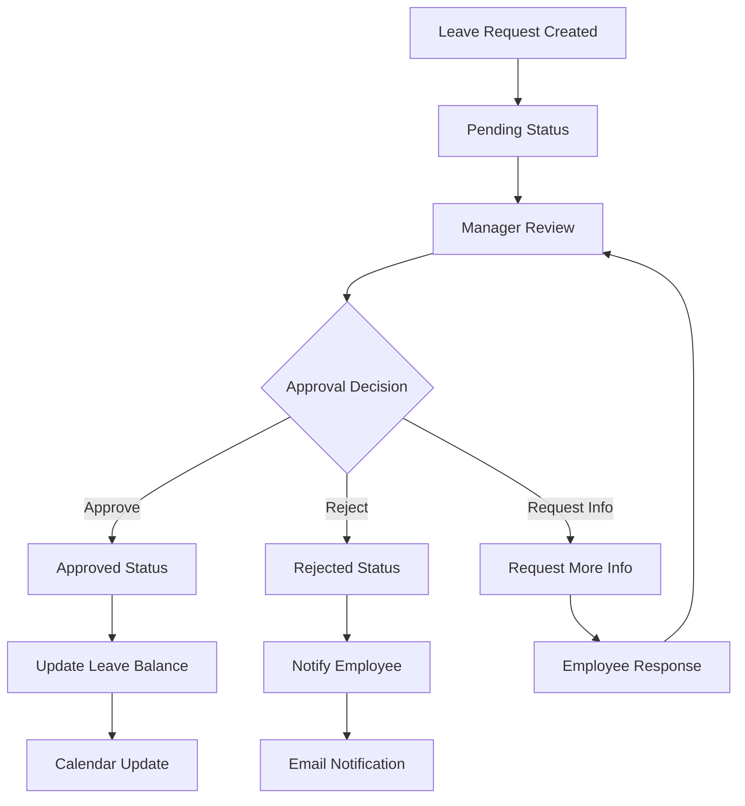

# Workflow Diagrams - Leave Management System

## Document Information
- **Document Version**: 1.0
- **Last Updated**: 2025-10-12
- **Author**: AI Development Team
- **Status**: Draft
- **Reviewers**: [Add stakeholders]

---

## 1. System Architecture Overview

### 1.1 High-Level System Architecture


### 1.2 Data Flow Architecture


---

## 2. Authentication Workflows

### 2.1 User Registration Flow


### 2.2 User Login Flow


### 2.3 Multi-Factor Authentication Flow


---

## 3. Leave Management Workflows

### 3.1 Leave Request Submission Flow


### 3.2 Leave Approval Workflow


### 3.3 Leave Balance Calculation Flow


---

## 4. Manager Workflows

### 4.1 Team Calendar View Flow


### 4.2 Team Coverage Management Flow


---

## 5. Admin/HR Workflows

### 5.1 User Management Flow


### 5.2 Leave Policy Configuration Flow


### 5.3 Reporting and Analytics Flow


---

## 6. Document Management Workflows

### 6.1 Document Upload Flow


### 6.2 Document Expiry Management Flow


---

## 7. Error Handling Workflows

### 7.1 Authentication Error Handling


### 7.2 API Error Handling Flow


---

## 8. System Monitoring Workflows

### 8.1 Performance Monitoring Flow


### 8.2 Security Monitoring Flow


---

## 9. Backup and Recovery Workflows

### 9.1 Database Backup Flow


### 9.2 Disaster Recovery Flow
```mermaid
sequenceDiagram
    participant M as Monitoring System
    participant A as Alert System
    participant O as Operations Team
    participant R as Recovery System
    participant S as Stakeholders
    
    M->>A: Detect System Failure
    A->>O: Send Emergency Alert
    O->>R: Initiate Recovery
    R->>R: Assess Damage
    R->>R: Select Recovery Strategy
    R->>R: Execute Recovery Plan
    R->>O: Recovery Status Update
    O->>S: Notify Stakeholders
    R->>R: Verify System Health
    R->>O: Recovery Complete
    O->>S: Send Recovery Confirmation
```

---

## 10. Integration Workflows

### 10.1 Email Integration Flow
```mermaid
sequenceDiagram
    participant T as Trigger Event
    participant Q as Queue System
    participant W as Worker
    participant E as Email Service
    participant U as User
    
    T->>Q: Add to email queue
    Q->>W: Process queue item
    W->>E: Send email request
    E->>U: Deliver email
    U->>E: Open/Click tracking
    E->>W: Send delivery status
    W->>Q: Update queue status
    Q->>T: Send completion notification
```

### 10.2 Calendar Integration Flow
```mermaid
graph TD
    A[Leave Approved] --> B[Create Calendar Event]
    B --> C[Format Event Data]
    C --> D[Sync with External Calendar]
    D --> E{Sync Successful?}
    E -->|Yes| F[Update UI]
    E -->|No| G[Handle Sync Error]
    G --> H[Retry Sync]
    H --> I{Max Retries Reached?}
    I -->|Yes| J[Log Error]
    I -->|No| D
    J --> K[Notify Admin]
    K --> L[Manual Sync Option]
```

---

## 11. Compliance and Audit Workflows

### 11.1 Audit Logging Flow
```mermaid
sequenceDiagram
    participant U as User Action
    participant A as Application
    participant L as Logger
    participant D as Database
    participant R as Report Generator
    
    U->>A: Perform action
    A->>L: Log action details
    L->>D: Store audit record
    D->>L: Confirm storage
    L->>A: Log confirmation
    A->>U: Return action result
    R->>D: Query audit logs
    D->>R: Return log data
    R->>A: Generate audit report
    A->>U: Display report
```

### 11.2 Data Retention Flow
```mermaid
flowchart TD
    A[Monthly Retention Check] --> B[Query Data by Age]
    B --> C[Apply Retention Policy]
    C --> D{Data Eligible for Removal?}
    D -->|Yes| E[Archive Data]
    D -->|No| F[Keep Data]
    E --> G[Create Archive Record]
    G --> H[Update Retention Index]
    H --> I[Remove from Active Storage]
    I --> J[Generate Retention Report]
    J --> K[Notify Compliance Officer]
    K --> L[Archive Verification]
    L --> M[Confirm Archive Success]
```

---

## 12. Mobile App Workflows

### 12.1 Mobile Authentication Flow
```mermaid
sequenceDiagram
    participant M as Mobile App
    participant B as Biometric Auth
    participant F as Frontend
    participant A as API
    participant S as Session
    
    M->>B: Request biometric auth
    B->>M: Biometric scan
    M->>F: Send auth request
    F->>A: Mobile login request
    A->>S: Validate session
    S->>A: Return session status
    A->>F: Return auth token
    F->>M: Store session
    M->>F: Update UI state
    F->>M: Show dashboard
```

### 12.2 Mobile Push Notification Flow
```mermaid
graph TD
    A[Server Event] --> B[Generate Notification]
    B --> C[Send to Push Service]
    C --> D[Route to Device]
    D --> E[Display Notification]
    E --> F{User Action}
    F -->|Tap| G[Open App]
    F -->|Dismiss| H[Clear Notification]
    F -->|Settings| I[Open Notification Settings]
    G --> J[Handle Deep Link]
    J --> K[Navigate to Relevant Screen]
    I --> L[Update Notification Preferences]
    L --> M[Sync with Server]
```

---

## 13. Performance Optimization Workflows

### 13.1 Caching Strategy Flow
```mermaid
sequenceDiagram
    participant R as Request
    participant C as Cache Layer
    participant D as Database
    participant S as Cache Service
    
    R->>C: Check cache
    C->>C: Query cache
    C->>C{Cache Hit?}
    C--|Yes|>>R: Return cached data
    C--|No|>>D: Query database
    D->>C: Return fresh data
    C->>S: Update cache
    S->>C: Cache updated
    C->>R: Return fresh data
```

### 13.2 Database Optimization Flow
```mermaid
flowchart TD
    A[Query Performance Monitor] --> B[Slow Query Detection]
    B --> C[Query Analysis]
    C --> D{Optimization Needed?}
    D -->|Yes| E[Add Index]
    D -->|No| F[Continue Monitoring]
    E --> G[Test Performance]
    G --> H{Performance Improved?}
    H -->|Yes| I[Monitor New Baseline]
    H -->|No| J[Try Alternative Optimization]
    J --> K[Review Query Plan]
    K --> L[Refine Query]
    L --> G
```

---

## 14. Deployment Workflows

### 14.1 CI/CD Pipeline Flow
```mermaid
sequenceDiagram
    participant D as Developer
    participant G as Git Repository
    participant C as CI Server
    participant T as Test Suite
    participant B as Build System
    participant V as Vercel
    participant S as Supabase
    
    D->>G: Push code changes
    G->>C: Trigger CI pipeline
    C->>T: Run tests
    T->>C: Test results
    C->>B: Build application
    B->>C: Build artifacts
    C->>V: Deploy to staging
    V->>C: Deployment status
    C->>S: Run migrations
    S->>C: Migration status
    C->>V: Deploy to production
    V->>C: Production deployment
    C->>D: Deployment notification
```

### 14.2 Rollback Flow
```mermaid
graph TD
    A[Deployment Issue Detected] --> B[Assess Impact]
    B --> C{Immediate Rollback Needed?}
    C -->|Yes| D[Trigger Emergency Rollback]
    C -->|No| E[Monitor Issue]
    E --> F{Issue Escalates?}
    F -->|Yes| D
    F -->|No| G[Continue Monitoring]
    D --> H[Restore Previous Version]
    H --> I[Verify System Health]
    I --> J{System Stable?